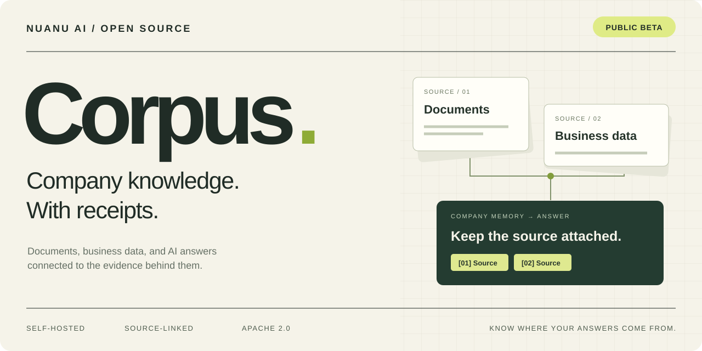
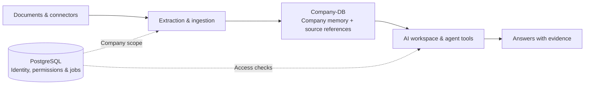

<p align="center">
  
</p>

<p align="center">
  <a href="https://github.com/nuanu-ai/Corpus/actions/workflows/ci.yml"></a>
  <a href="LICENSE"></a>
  
  <a href="CONTRIBUTING.md"></a>
</p>

<p align="center">
  <a href="#quick-start">Quick start</a> ·
  <a href="docs/INDEX.md">Documentation</a> ·
  <a href="#how-it-works">Architecture</a> ·
  <a href="CONTRIBUTING.md">Contribute</a> ·
  <a href="https://github.com/nuanu-ai/Corpus/issues">Issues</a>
</p>

## Your company has knowledge. Give it a memory.

Corpus is a self-hosted AI workspace for company knowledge. Bring in documents and connected business data, build a searchable company memory, and ask questions with references back to the evidence.

Built by [Nuanu AI](https://github.com/nuanu-ai). Open source under Apache 2.0.

> **Public beta.** This is an early release for development and evaluation. The included companies, people, and data are synthetic. See the [security model](docs/security-model.md) and [configuration guide](docs/configuration.md) before operating a deployment.

## What is inside

| Capability | What it does |
| --- | --- |
| **Knowledge with provenance** | Preserve references from ingested records to the documents and sources they came from. |
| **A workspace for each company** | Separate application permissions from per-company indexed knowledge in Company-DB. |
| **Documents + connected data** | Ingest documents and connect business systems through scoped adapters. |
| **Answers you can inspect** | Retrieve company context and keep supporting references attached to answers and artifacts. |
| **Tools for agents** | Expose bounded retrieval through MCP and API surfaces, with approval gates for consequential workflows. |
| **Your infrastructure** | Run the application, PostgreSQL, and Company-DB yourself; configure model providers and connectors explicitly. |

Connector adapters include Google Drive, Slack, Odoo, Stripe, Plaid, and custom MCP/OpenAPI services. Each requires its own setup and permissions; adapters are not a guarantee of end-to-end validation against every provider.

## How it works



The Next.js app handles the interface, authentication, API, and workflow orchestration. PostgreSQL stores application metadata. Company-DB keeps indexed knowledge per company. An optional Python service handles document extraction.

[Explore the architecture →](docs/architecture.md)

## Quick start

**You will need:** Node.js 22, npm 10+, and a running PostgreSQL 15+ database. AI chat also needs a configured supported model provider. Python 3.11+ is needed only for the optional extraction service.

```bash
git clone https://github.com/nuanu-ai/Corpus.git
cd Corpus
nvm use                       # or use your preferred Node.js version manager
npm ci
cp .env.example .env.local
```

Create an empty PostgreSQL database and edit `.env.local`:

- Set `DATABASE_URL` to your database connection string.
- Generate separate `BETTER_AUTH_SECRET` and `COMPANY_DB_INTERNAL_SERVICE_SECRET` values with `openssl rand -base64 32`.
- Generate `ENCRYPTION_KEY` with `openssl rand -hex 32`.
- Configure a supported AI provider; see [configuration](docs/configuration.md).

Then build Company-DB, apply the schema to your local database, and start the app:

```bash
npm run --workspace @corpus/company-db build
npm run db:push
npm run dev
```

Open **[localhost:3000](http://localhost:3000)**.

The example configuration enables synthetic demo mode. Configure authentication, storage, workers, and connector credentials for your own deployment; disable demo mode before production use. The optional extraction service has separate [Python dependencies](extraction/requirements.txt).

## Find your way around

| Path | Contents |
| --- | --- |
| [`app/`](app/) | Next.js interface and API routes |
| [`lib/`](lib/) | Auth, agents, connectors, ingestion, reporting, and business logic |
| [`packages/company-db/`](packages/company-db/) | Per-company indexed knowledge service |
| [`extraction/`](extraction/) | Optional Python document extraction |
| [`drizzle/`](drizzle/) | Database migrations |
| [`docs/`](docs/INDEX.md) | Architecture, configuration, and security documentation |
| [`skills/`](skills/) | Example agent integration material |

## Development

```bash
npm run release:check     # Public-export hygiene checks
npm run lint
npm run typecheck
npm test                 # Builds Company-DB, then runs the synthetic tests
npm run build
```

See the [fixture policy](lib/mock-data/README.md) and [release checklist](docs/release-checklist.md). The current synthetic test suite is deliberately small; passing it does not establish production readiness.

## Make it better

Useful contributions include reproducible bugs, documentation improvements, synthetic test cases, and connector fixes. Start with the [contribution guide](CONTRIBUTING.md), or [open an issue](https://github.com/nuanu-ai/Corpus/issues/new/choose) describing the problem you want to solve.

Please keep real company data and credentials out of issues, fixtures, and pull requests. Report vulnerabilities through [private security reporting](https://github.com/nuanu-ai/Corpus/security/advisories/new).

Telegram Bot API support is included. User-account Telegram sync requires a separately maintained, license-compatible adapter; an MTProto client is not bundled.

---

[Apache 2.0](LICENSE) · [Notices](NOTICE) · [Code of conduct](CODE_OF_CONDUCT.md) · [Security](SECURITY.md)
